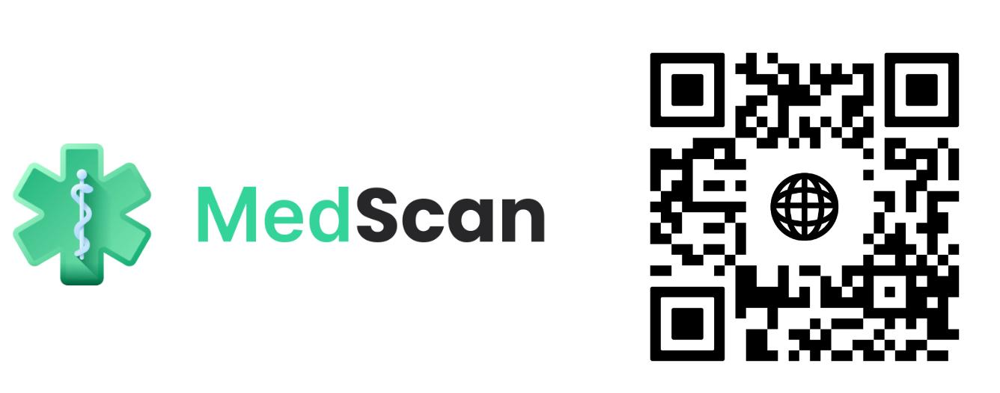

# MedScan

Scan the QR code below to access our platform:

MedScan is an **AI-driven health application** created during the **HackTech Hackathon**, where it won **1st place**. The project was developed by a team of four, including myself, focusing on delivering personalized specialist recommendations through the analysis of user-inputted symptoms, medical documents, and real-time health data.

## Problem Statement

Many users turn to online symptom-checkers and often find alarming or inaccurate information. This can lead to increased anxiety and unnecessary healthcare visits. MedScan addresses this problem by delivering reliable, balanced insights powered by AI.

## My Contributions

- **Backend Development**: Collaborated with one team member to build the backend using **FastAPI** and **SQLAlchemy**, ensuring efficient data handling and robust API functionality.
- **Database Modeling**: Designed and modeled the database structure to support seamless data storage and retrieval for the application's functionalities.
- **Endpoint Implementation**: Wrote and managed most of the key endpoints to facilitate seamless data flow and interaction between the frontend and AI model server.
- **Google Fit API Integration**: Integrated the **Google Fit API** to provide personalized health metrics, enhancing the analysis with real-time data.
- **Prompt Engineering**: Conducted prompt engineering to optimize and enhance the quality of AI-driven recommendations and outputs.

## Key Features

- **Real-Time Symptom Analysis**: Input symptoms and receive tailored questions for more context.
- **Specialist Recommendations**: Receive the top three recommended specialties with explanations and probability scores.
- **Google Fit Integration**: Enhance analysis with real-time health data such as activity levels and vital signs.
- **Document Uploads**: Upload PDFs, images, or DOCX files for comprehensive medical context.

## Tech Stack

### Frontend
- **Technology**: React with TypeScript
- **Hosting**: Google Cloud Run
- **Features**: User interface for inputting symptoms, uploading documents, and viewing recommendations.

### Backend
- **Technology**: Python with FastAPI
- **Hosting**: Google Cloud Run
- **Features**: API for processing data, handling business logic, and connecting with the AI model server.

### Authentication
- **Technology**: Firebase, Google Identity Platform
- **Features**: Secure login, user management, and data synchronization.

### Health Data Integration
- **Technology**: Google Fit API
- **Features**: Real-time retrieval of health metrics to personalize the user experience.

### AI Model
- **Technology**: Llama 3.1 70B Model
- **Features**: Analyzes symptoms and documents, generating AI-powered recommendations.

## User Journey

1. **Account Creation/Login**: Create an account or log in using Google for seamless integration with Google Fit.
2. **Symptom Entry**: Enter symptoms and respond to follow-up questions.
3. **Document Upload**: Add supporting medical documents for more comprehensive analysis.
4. **Data Analysis**: The backend processes the input data and retrieves Google Fit data.
5. **Recommendations**: The app provides a list of top specialties, probability scores, and suggested next steps.

## Future Improvements

- **Frontend File Uploads**: Integrate direct file upload capabilities in the app interface.
- **Automated PDF Reports**: Generate detailed reports with referral recommendations for doctors.
- **Enhanced AI Models**: Improve the existing model for better accuracy and detail.

